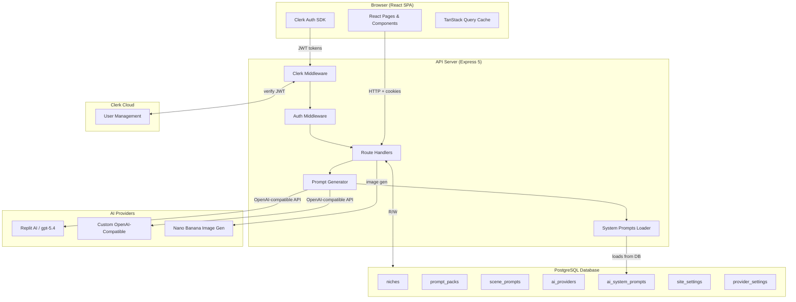
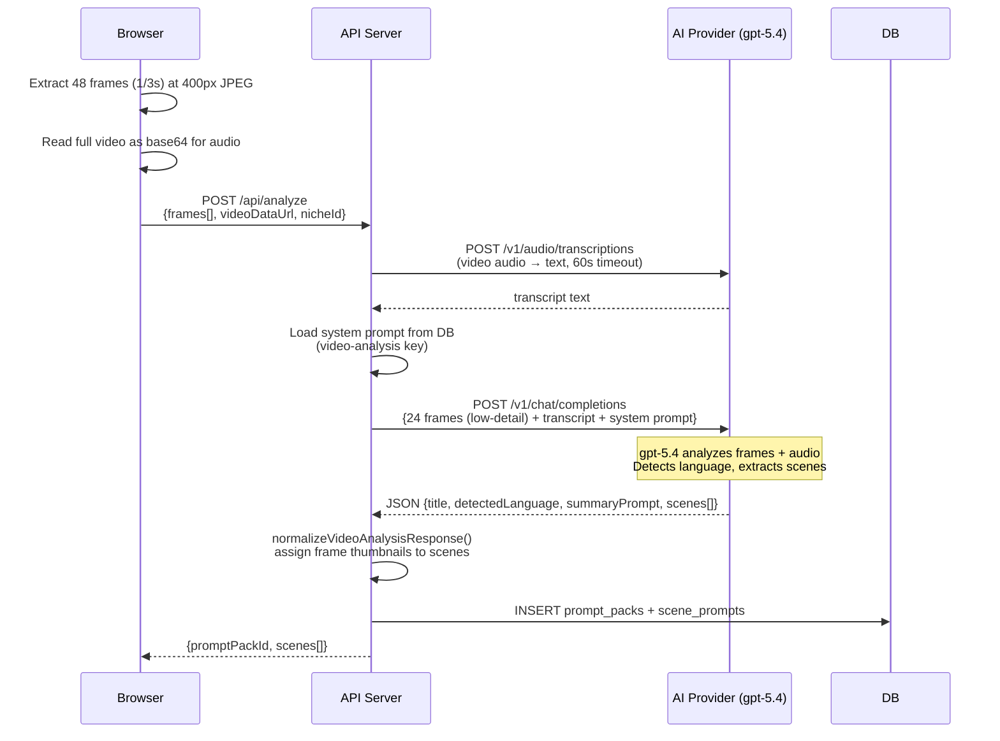
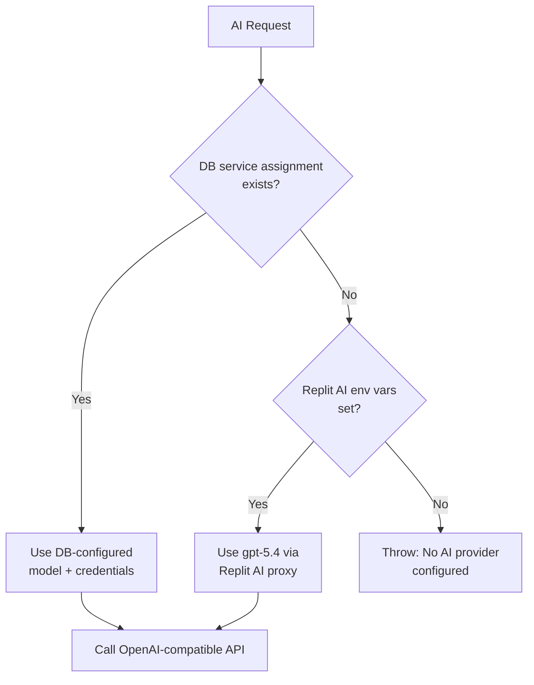
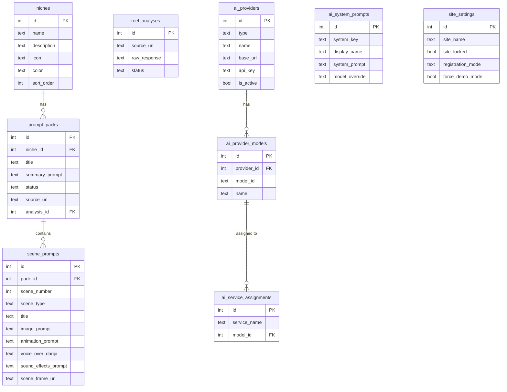
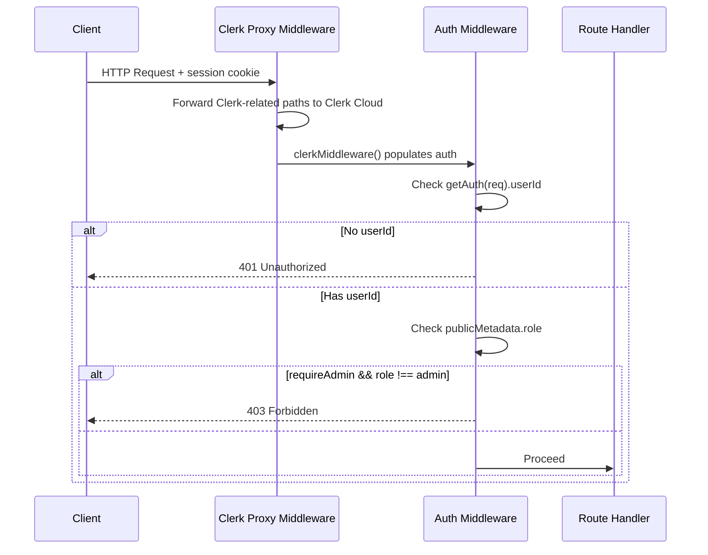

# Architecture — Reel Prompt Studio

## Overview

The project is a **pnpm monorepo** with three main artifacts and three shared libraries.

```
┌─────────────────────────────────────────────────────────┐
│                    pnpm Workspace                        │
│                                                          │
│  artifacts/                     lib/                    │
│  ├── reel-prompt-studio  ←──── api-client-react         │
│  │   (React + Vite SPA)         api-zod                 │
│  │                              db                      │
│  ├── api-server           ──────┘                       │
│  │   (Express 5 API)                                    │
│  │                                                      │
│  └── mockup-sandbox                                     │
│      (Component Preview)                                │
└─────────────────────────────────────────────────────────┘
```

## System Architecture Diagram



## Video Analysis Flow



## AI Provider Resolution



## Database Schema



## Request Authentication Flow


